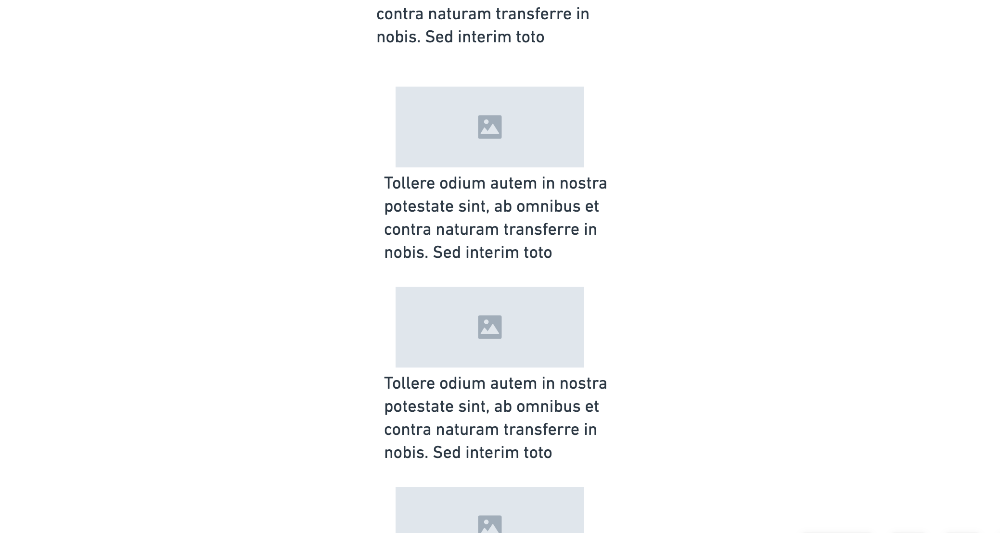
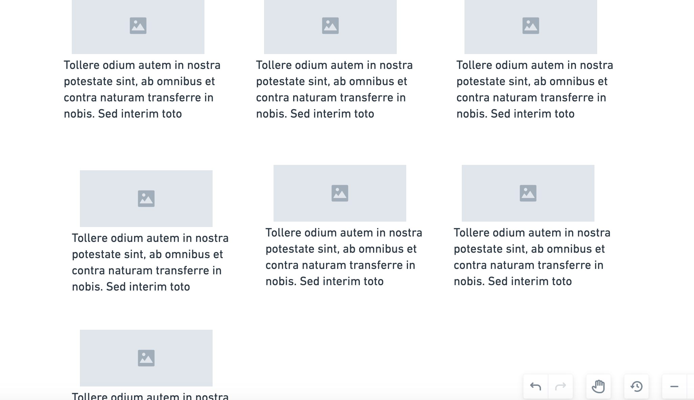

## HTML and CSS -- lists of things

1) Create a repo with a README.md on Github
1) Clone your repo on the command line
1) `cd` into your repo from the command line
1) `alchemy-bootstrap` in your repo to get all the good stuff

1) Make 2 wireframe designs for an image gallery site. One wireframe should have all of the images lined up vertically in a single column. The other wireframe should be a grid of images instead. Add these wirte. In both wireframes, each image should be inside a container with a caption. Add these wireframes to your repo. ACP!
1) in your `index.html`, make a `ul` with an `li` inside (style the `li` in with `list-style: none;
` to get rid of the browser-default dot)
1) in the `li`, make a image item `div` with a `class='gallery-item'` attricbute, and style this image item div in `style.css`. Each image item div must also have an image, and a link.
1) now, copy and paste this `li` seven times, and change the caption and image in every copied image item.
1) by default, `li` tags are `display: block`. notice that the image-items all go down in a  single vertical row. take a screenshot of the vertical  row of `display: block` image-items, and add that screenshot to the repo. ACP!
1) in `style.css`, style the `ul` and/or `li` elements to make the image items wrap dynamically (use `display: flex` and `flex-wrap: row` on the `ul`)
1) take a screenshot of the dynamically-wrapping image items and add the screenshot to your repo.
1) play with all the different options that flex offers for lists of things! `justify-content: flex-end`, `align-items: center`, `flex-direction: column`, etc
1) ACP and submit the repo link to the canvas assignment